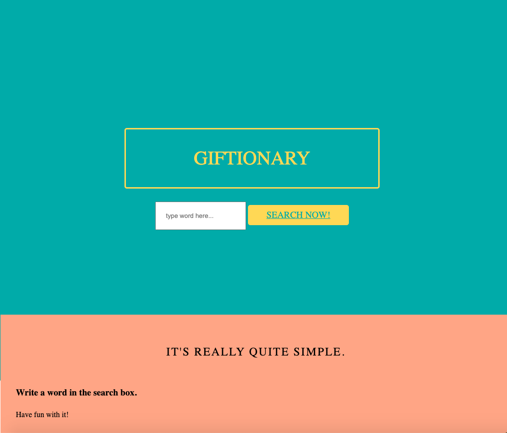
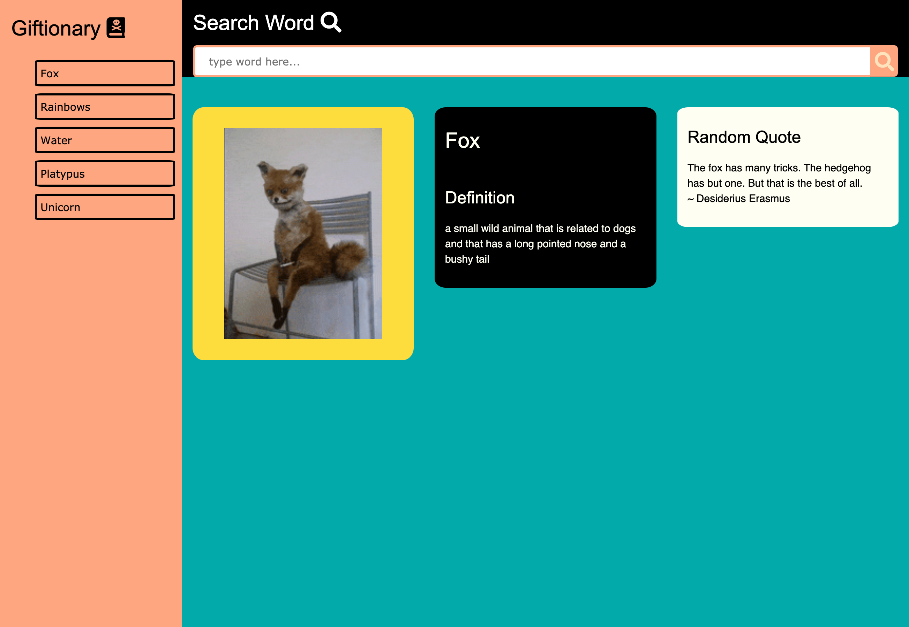

# Giftionary

[Go to Live Giftionary Page](https://beccablanton.github.io/giftionary/)

## What is it

Giftionary is a search page that provides the user with the proper definition, a gif, and a quote upon the user typing in the word of their choice.

## Technologies Used

* HTML
* CSS, including CSS frameworks W3 and PureCSS
* JavaScript
* jQuery
* 3 API's (Giphy, Merriam Webster, Quote Garden)

## License
[MIT License](./LICENSE)
### Contact Info:

* Created By: 

[Becca Blanton](https://github.com/BeccaBlanton)
[Madeline Morris](https://github.com/madehopemorr)
[Samantha Grothaus](https://github.com/sgrothaus97)

## User Stories

as a STUDENT
I WANT to see definitions as well as images when searching for a word
SO THAT I can learn visually, and be provided with more context when trying to learn new words.

as a TEACHER
I WANT to provide my students with a fun dictionary resource tool
SO THAT when they search a word and its meaning, they are provided with a visual example as well. 

As a GRANDMA
I WANT to understand who Kanye West is,
SO THAT when I visit with my grandkids, 
THEN I will know several things about Kanye… 
SUCH AS what he looks like and common quotes of his.
